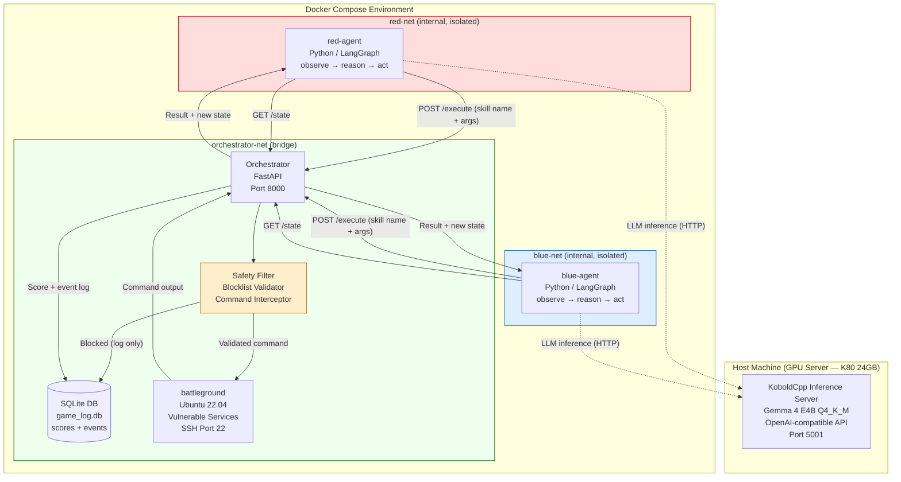

# System Architecture

## Hub-and-Spoke Container Architecture



## Network Isolation

| Network | Members | Purpose |
|---------|---------|---------|
| `red-net` | red-agent, orchestrator | Red agent communication only |
| `blue-net` | blue-agent, orchestrator | Blue agent communication only |
| `orchestrator-net` | orchestrator, battleground | Command execution channel |

**Key constraint:** red-agent and blue-agent are on separate isolated networks. They cannot communicate with each other or with battleground directly. All traffic routes through the orchestrator.

## Data Flow

```
Agent → POST /execute {skill, args}
      → Orchestrator validates skill name
      → Safety Filter checks command against blocklist
      → SSH exec on battleground (Paramiko)
      → Output truncated to 4096 chars
      → Score awarded, event logged to SQLite
      → JSON result returned to agent
      → Agent updates LangGraph state
      → Next observe → reason → act cycle
```

## Inference Architecture

```
Agent LangGraph node (reason)
  → HTTP POST to KoboldCpp (host:5001/v1/chat/completions)
  → Gemma 4 E4B generates JSON action
  → Regex fallback parser if JSON malformed
  → Up to 3 retries with format hints
  → Sequential: only one agent infers at a time
```

KoboldCpp runs directly on the host to access the K80 GPU via CUDA 3.7. Containers reach it via `host.docker.internal`.
